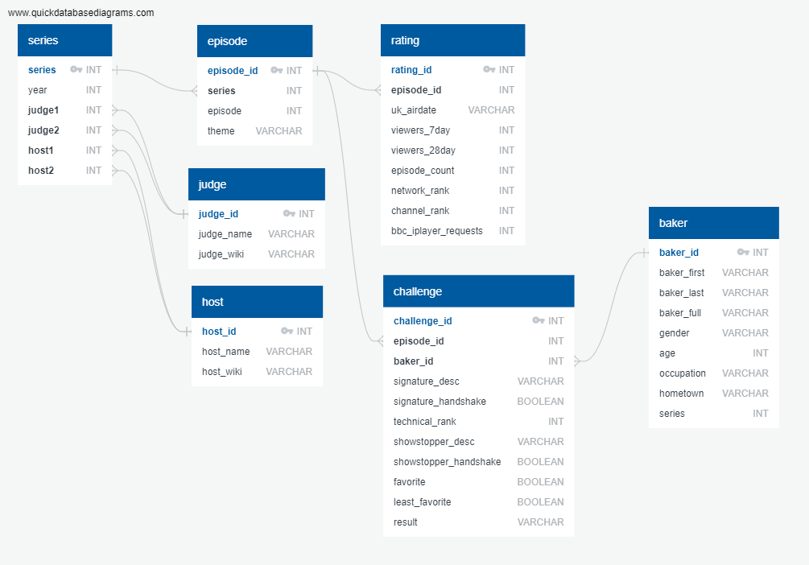

# the_great_bakeoff

## Project Proposal

### Datasets
1. json files from https://github.com/apreshill/bakeoff/tree/master/inst/extdata

2. xlsx file from https://docs.google.com/spreadsheets/d/1cvouOik_01QqtFQSq78xODIjcZZ8A-02VXa6IBvdG3I/edit?fbclid=IwAR2DwlJdxeFZzOYjcHhrzG0QTEeqmOGiZ_oEC4yM7coKk4wfoa6k1zESG_A#gid=0

### The Plan
1. Make this repo and upload raw files
2. Import files into pandas dataframes in a Jupyter Notebook
3. Inspect dfs and decide which variables we are interested in from each table
4. Design ERD to structure data
5. Adjust dfs in Pandas to fit ERD
6. Create tables in PostgreSQL based on ERD
7. Add dfs to SQL tables
8. Update GitHub repo and submit

## Project Report

### Extracting the data

We downloaded the following documents from our data sources and placed them in the `raw_data` folder:

1. Apreshill GitHub
  * bakers.json
  * bakes.json
  * challenges.json
  * episodes.json
  * ratings.json
  * results.csv
2. Nick Ahamed Google Sheet
  * GBBO_Data_Set.xlsx

We then read each of these data files into python/pandas using a Jupyter Notebook. Because of unique formatting in some of the json documents, this required some more creative approaches than expected.

#### Baker Data

The baker json includes each baker's full name ('baker_full'), their age, occupation, and hometown. The raw data is a list of list of dictionaries (json is normally a list of dictionaries) so we needed to loop through each list to get that season's information.

#### Challenge Data

The challenges-, bakes-, and episodes.json files all contain information on what each baker made during each of the three challenges each episode. The bakes.json only has information up to season 8. Both the challenges.json and the episodes.json go through season 10 and are exactly identical. We will get our data from only the challenges json. This file contains info on the season number (called 'series' in the UK), episode, baker's FIRST NAME ONLY ('baker'), signature dish name ('signature'), ranking in the technical challenge ('technical'), and showstopper dish name ('showstopper').

We again employed a loop to read the challenge.json into a pandas DataFrame.

#### Ratings Data

The ratings json file is in a normal json format (YAY!!) and can easily be read into pandas with the pd.read_json() command. This file contains information on the original air date of the episode ('uk_airdate'), how many million people watched the episode over the next 7 days ('viewers_7day'), and the next 28 days ('viewers_28day'), and a running episode count of all GBBO ('episode_count'). Seasons 4 thru 10 have a network rank ('network_rank') and Seasons 6 thru 10 have a channel rank ('channel_rank') published. Seasons 6 and 7 have information on how many million people streamed each episode on BBC iPlayer ('bbc_iplayer_requests').

#### Results Data

The results of each episode are in the results.csv file with the pd.read_csv() command. This file describes the fate of each baker by episode and categorizes their 'result' as either IN, OUT, STAR BAKER, WINNER, SICK, Runner-up or NaN. WINNER and Runner-up only apply to the last episode of the season.

#### GBBO Summary Table

The data thus far have been compiled and published by apreshill on GitLab. Another GBBO fan, Nick Ahamed, made his own spreadsheet documenting outcomes of episodes and included valuable information such as records of the famous Hollywood Handshake and who the judges discuss as being their favorite and least favorite bakers of the week at the end of Day 1, just before the Showstopper challenge. This was easily loaded into a pandas dataframe then cleaned so the column names were easier to work with.

### Transforming the Data

After designing our database and generating a ERD on quickdatabasediagrams.com, we began manipulating the data in python/pandas to be in the same format we wanted to upload to PostGreSQL.

#### Series, Judge and Host Tables
As these are small tables for only 10 series of shows, 3 Judges and 4 hosts, these tables were created manually using a dictionary.

#### Episode Table
The episode table was created by taking the 'season', 'week_number' and 'week_name' columns from the GBBO Summary Table and adding a unique 'episode_id' to each of these combinations.

#### Rating Table
The rating table was simply the ratings.json with an added unique id for each row.

#### Challenge Table
The challenge table is a conglomeration of the data found in challenge.json and GBBO_Summary_Table.xlsx that uses a unique episode_id and baker_id to relate to those respective tables.

#### Baker Table
The baker table is mostly just the bakers.json dataframe with gender of each baker taken from the GBBO Summary Table. Each baker was given a unique baker_id.

### Loading the Data
Each table, now formatted correctly, was loaded into our local database using 'pd.df.to_sql()' after creating each table using the exported sql queries from QuickDBD.

